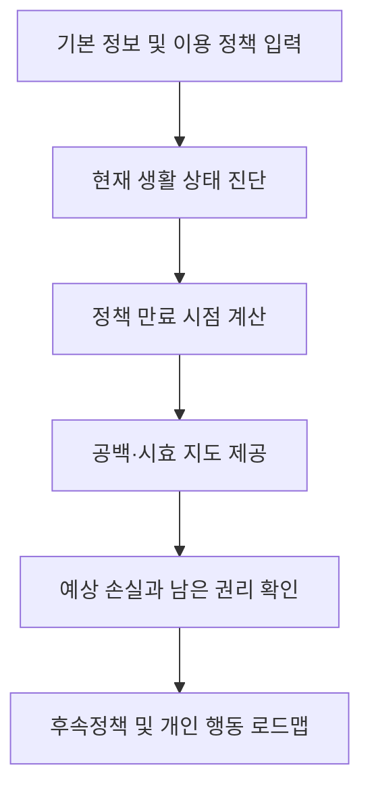

# 이음틈

> 청년과 그다음 삶을 잇는 전환 관리 서비스

**2026 시그니처 대회 대상 수상작**

청년지원 종료를 앞둔 비혼 1인 가구가 주거, 경제, 복지, 관계·돌봄의 공백을 미리 발견하고 다음 행동을 준비하도록 돕는 서비스입니다.

## 프로젝트 소개

이음틈은 청년정책의 연령 또는 지원기간 상한을 앞둔 비혼 1인 가구가 지원이 끝난 뒤가 아니라, **지원이 끝나기 전에 다음 삶을 준비하도록 돕는 서비스**입니다.

사용자의 생년월일, 거주지역, 소득구간, 취업상태, 현재 이용 중인 정책을 바탕으로 정책 종료 시점을 계산하고 예상되는 생활 변화와 후속 행동을 연결합니다.

## 프로젝트 정보

| 항목 | 내용 |
| --- | --- |
| 프로젝트 | 2026 시그니처 대회 대상 프로젝트 |
| 결과 | 대상 수상 |
| 기간 | 2026.09.12 - 2026.09.19 |
| 형태 | 3인 팀 프로젝트 |
| 타깃 | 청년지원 종료를 앞두었거나 최근 연령 상한을 지난 비혼 1인 가구 |
| MVP 범위 | 서울 거주 미혼 1인 가구, 주거·경제 영역, 대표 정책 5-10개 |
| 산출물 | 서비스 기획, 정책 리서치, UI/UX 디자인, 인터랙티브 프로토타입 |
| 도구 | Figma, PowerPoint |

### Prototype

[View the Figma Design](https://www.figma.com/design/Rq9ihHqUNwbNydSDLNtomL/%EC%9D%B4%EC%9D%8C?node-id=0-1&t=DrnYFyGQQhuGGIou-1)

## 문제 정의

한국의 생애주기 정책은 일반적으로 다음과 같은 흐름을 전제로 합니다.

`청년 → 취업 → 결혼 → 신혼부부 → 출산·양육 → 가족 복지`

그러나 비혼 1인 가구는 청년정책의 연령이나 지원기간 상한에 도달하면 기존 지원에서 이탈하면서도, 신혼부부와 자녀가구 중심의 다음 지원으로 이동하기 어렵습니다.

이 과정에서 다음과 같은 공백이 발생합니다.

| 공백 | 설명 |
| --- | --- |
| 연결의 공백 | 종료되는 정책과 다음 선택지가 자동으로 이어지지 않음 |
| 정보의 공백 | 무엇이 언제 끝나고 무엇을 준비해야 하는지 알기 어려움 |
| 권리·기회의 공백 | 신청 마감, 신규가입 기한 등 남은 권리를 놓침 |
| 관계·돌봄의 공백 | 응급 보호자, 정서적 지지, 일상 돌봄을 스스로 설계해야 함 |

## 기존 서비스와의 차이

| 기존 정책 플랫폼 | 이음틈 |
| --- | --- |
| 현재 신청할 수 있는 정책 검색 | 현재 상태와 곧 종료될 시점에서 시작 |
| 개별 정책 정보를 나열 | 종료되는 정책과 후속정책의 관계를 연결 |
| 사용자가 직접 검색해야 함 | 이용 중인 정책의 만료 시점을 미리 계산 |
| 추천할 정책이 없으면 검색 종료 | 후속정책이 없는 공백도 기록하고 가시화 |
| 지원금과 제도 중심 | 주거·경제뿐 아니라 관계·돌봄과 생활 관리까지 고려 |

## 핵심 기능

### 1. 전환 진단

사용자의 기본 정보와 현재 이용 중인 정책을 입력받고, 자가진단 문항을 통해 현재 생활 상태를 분석합니다.

### 2. 공백·시효 지도

정책별 연령과 지원기간 상한을 기준으로 만료 시점을 계산합니다.

현재 상태뿐 아니라 6개월 후와 1년 후의 예상 상태를 함께 보여주어 다가오는 변화를 미리 확인할 수 있도록 합니다.

### 3. 행동 설계

발견한 공백을 정보 제공에서 끝내지 않고 실제 행동으로 연결합니다.

- 지원 종료 후 예상되는 비용 증가를 금액으로 표시
- 종료 전에 행사할 수 있는 권리를 체크리스트로 안내
- 유사한 목적의 일반·1인 가구 정책 추천
- 오늘, 1개월, 3-6개월 단위의 개인 로드맵 제공
- 규칙 기반 자격 판정 결과와 공식 정책 내용을 AI가 쉬운 말로 설명

## 서비스 흐름

## 4대 생활 영역

| 영역 | 다루는 정책과 행동 |
| --- | --- |
| 주거 | 월세지원, 공공·전세임대, 저리대출, 주거비 변화 |
| 경제 | 자산형성, 정책금융, 취업지원, 직업훈련 |
| 관계·돌봄 | 비상연락망, 병원 동행 등 단계적 상호돌봄 |
| 복지·문화 | 마음건강, 고립·은둔 지원, 생활·문화 지원 |

## 구현 원칙

- **규칙 기반 판정:** 정책 자격과 만료일은 생년월일, 정책 시작일, 공식 정책 조건을 기준으로 계산합니다.
- **AI의 역할 제한:** AI는 계산된 결과와 공식 내용을 쉽게 설명하며 최종 자격을 독자적으로 결정하지 않습니다.
- **출처와 기준일 표시:** 모든 정책 안내에 공식 출처와 최종 확인일을 표시합니다.
- **행동과 함께 알림:** 정책 만료 사실만 전달하지 않고 대비 행동과 후속 선택지를 함께 안내합니다.
- **공백도 결과로 기록:** 연결 가능한 정책이 없을 때도 이를 숨기지 않고 정책 공백 데이터로 기록합니다.

## 기대 효과

### 사용자 측면

- 지원 종료 이후의 생활비 증가를 사전에 파악
- 신청 마감과 남은 권리를 놓쳐 발생하는 미수급 감소
- 후속정책, 저축, 주거 이전 등에 필요한 준비기간 확보

### 사회적 측면

- 비혼 1인 가구의 정책 수요를 연령·지역·생활영역별로 가시화
- 반복되는 정책 단절과 후속지원 부재를 정책 개선 근거로 활용
- 청년과 가족 중심 정책 사이에 존재하는 사각지대 발견

## 주요 검증 지표

- 추천 정책 신청 페이지 이동률
- 추천 정책 실제 신청 완료율
- 종료 알림 이후 후속 행동 실행률
- 종료 전에 대체정책을 확보한 사용자 비율
- 청년정책 종료 후 대체정책을 찾지 못한 사용자 비율

## MVP와 향후 확장

초기 MVP는 서울 거주 미혼 1인 가구를 대상으로 주거와 경제 영역의 대표 정책 5-10개를 수동으로 관리하는 방식으로 설계했습니다.

향후 다음 기능으로 확장할 수 있습니다.

- 공식 정책 데이터 자동 연동
- 관계·돌봄 영역 지원
- 정기적인 생활 상태 재진단
- 정책 만료 카운트다운 및 알림
- 지역별·연령별 정책 공백 데이터 분석
- 근거리 1인 가구 상호돌봄 연결

## 담당한 역할

- 서비스 아이디어 구체화 및 문제·해결 구조 논의
- 서비스 화면 구조와 사용자 흐름 설계
- 모바일 UI/UX 디자인
- 인터랙티브 프로토타입 제작
- 진단, 공백·시효 지도, 행동 설계 기능 시각화
- 팀 피드백을 반영한 화면 및 프로토타입 개선
- 발표 자료 제작과 최종 결과물 정리 참여

## 배운 점

이 프로젝트를 통해 기능부터 정하는 것보다 **현재 실제로 발생하는 문제를 구체적으로 정의하고, 문제와 해결방식을 직접 연결하는 과정**이 중요하다는 점을 배웠습니다.

또한 정책 안내 서비스에서는 많은 정보를 보여주는 것보다 사용자가 앞으로 놓칠 변화와 지금 해야 할 행동을 명확하게 보여주는 것이 더 큰 가치가 될 수 있음을 확인했습니다.

## 안내

이 저장소는 대회에서 제작한 서비스 기획과 프로토타입을 정리한 포트폴리오용 프로젝트입니다.

현재 실제 정책 자격을 판정하거나 신청을 처리하는 운영 서비스는 아닙니다.
